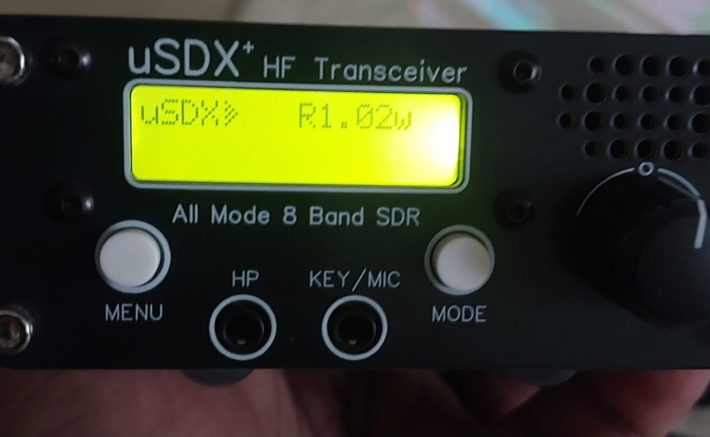
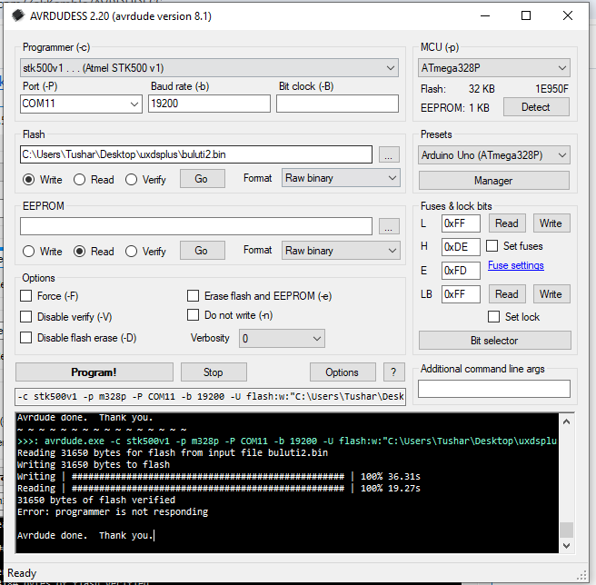

# uSDX+ v2 BULOTI
uSDX+ v2 (BULOTI) Original Firmware (raw binary) - by S21TIP

## [Download buloti_original.bin](https://github.com/tushroy/usdxpv2_BULOTI/raw/refs/heads/main/BULOTI_ORIG/buloti_original.bin)



### Write options command in avrdude

```avrdude.exe -c stk500v1 -p m328p -P COM11 -b 19200 -U flash:w:"C:\Users\Tushar\Desktop\uxdsplus\buluti2.bin":r ```

### Or use AVRDUDESS


